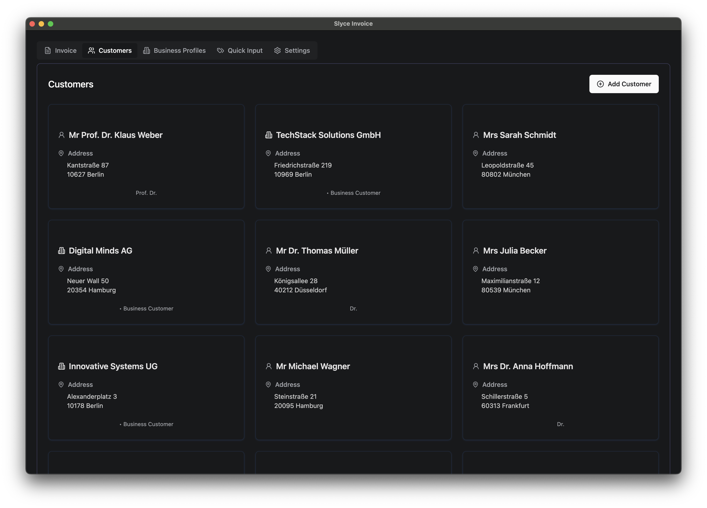
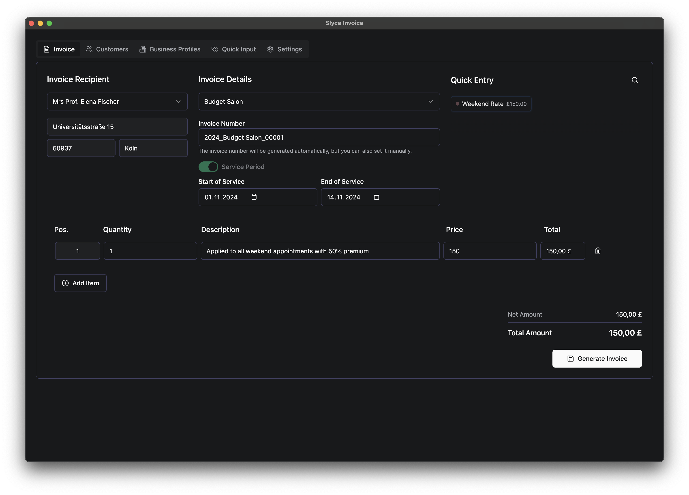
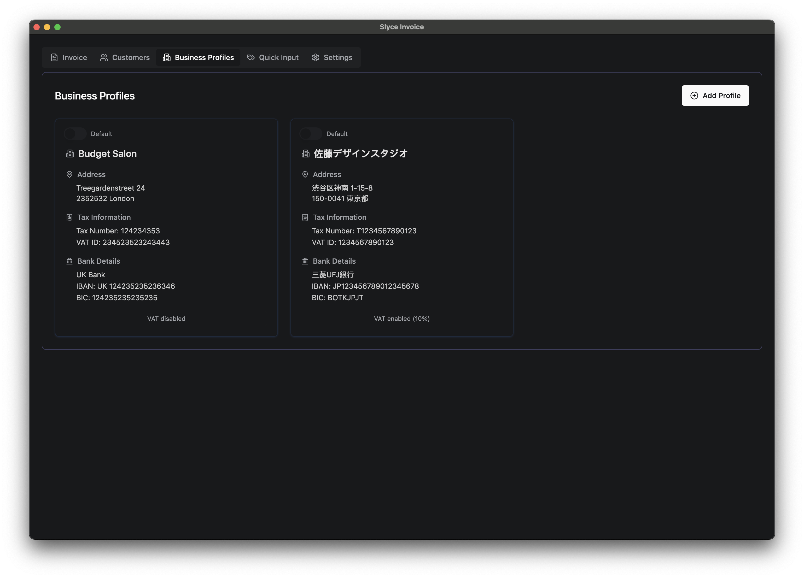
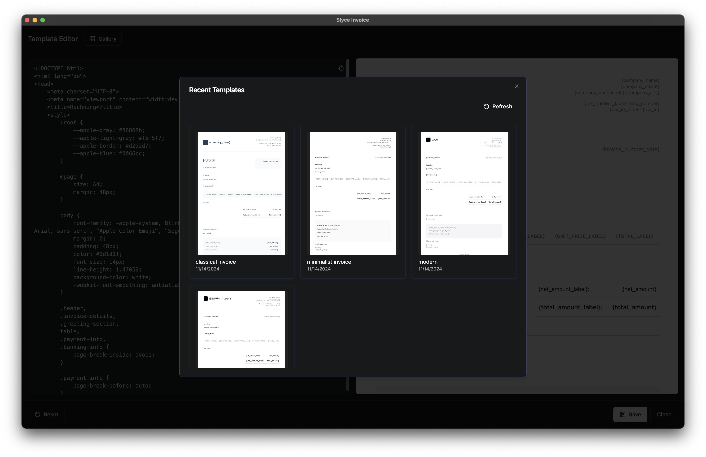

# Slyce Invoice

⚠️ **ALPHA STATUS**: This application is in early development. Currently only tested and working on macOS. Expect bugs and incomplete features.

A modern, cross-platform invoice generation application built with Electron and React, designed for freelancers and small businesses.


## Features

### Invoice Management
- Professional invoice creation with customizable templates
- Automatic numbering and organization
- Date range support for services
- PDF generation with live preview
- Multiple built-in templates with HTML/CSS customization

### Business & Customer Management
- Multiple business profiles with separate settings
- Comprehensive customer database
- Customer-specific currency and language settings
- Quick-tag system for frequent services

### Localization & Data
- 16 languages supported including RTL
- Automatic language selection based on customer region
- Secure data storage with automatic backups
- Export/Import functionality
- Dark/Light theme support

## Screenshots

<div align="center">

| Feature | Screenshot |
|---------|------------|
| Customer Management |  |
| Invoice Creation |  |
| Business Profiles |  |
| Template Gallery |  |

</div>

## System Requirements

- OS: Windows 10/11, macOS 10.13+, or Linux
- RAM: 4GB minimum
- Storage: 500MB free space
- Display: 1280x720 minimum
- Node.js 18+ (for development)

## Installation

### Users
Download the latest release for your platform from our [Releases](https://github.com/roadmaus/Slyce_Invoice/releases) page:
- Windows: `.exe` installer (x64/ARM64)
- macOS: `.dmg` installer (Intel/Apple Silicon)
- Linux: `.AppImage` or `.deb` package

### Developers
```bash
# Clone and setup
git clone https://github.com/roadmaus/Slyce_Invoice.git
cd Slyce_Invoice
npm install

# Development commands
npm run dev      # Start development server
npm run build    # Build production version
npm run dist     # Create distributables
npm run test     # Run tests
```

## File Organization

```
Documents/
└── Invoices/
    └── [YEAR]/
        └── [CUSTOMER]_[INVOICE_NUMBER].pdf

Application Data:
Windows: %APPDATA%/slyce-invoice
macOS:   ~/Library/Application Support/slyce-invoice
Linux:   ~/.config/slyce-invoice
```

## Contributing

1. Fork the repository
2. Create your feature branch (`git checkout -b feature/NewFeature`)
3. Commit changes (`git commit -m 'Add NewFeature'`)
4. Push to branch (`git push origin feature/NewFeature`)
5. Open a Pull Request

## ToDo
- [ ] Add better support for manual invoice numbering
- [ ] Windows and Linux platform testing
- [ ] Additional template options
- [ ] Performance optimizations

## Support

For issues and feature requests, please [open an issue](https://github.com/roadmaus/Slyce_Invoice/issues).

## License

MIT License - see the LICENSE file for details.

---

Built with ❤️ using Electron, React, and shadcn/ui components.