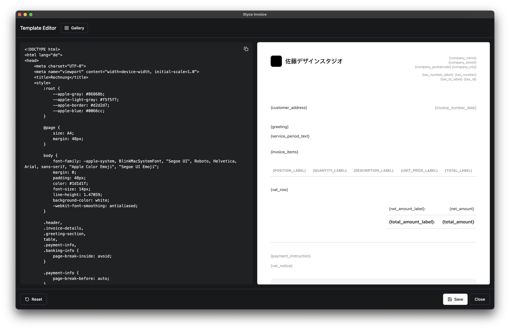

# Slyce Invoice

A modern, cross-platform invoice generation application built with Electron and React. Designed for freelancers and small businesses to create, manage, and track invoices efficiently.


## 📸 Screenshots

<div align="center">

### Customer Management

*View and manage your customer database with comprehensive contact information*

### Invoice Creation

*Create professional invoices with automatic numbering and date range support*

### Business Profiles

*Manage multiple business profiles with different tax and banking details*

### Quick Tags

*Create preset items for frequently used services with custom pricing*

### Settings & Localization

*Configure language, currency, and other preferences*

### Template Customization

*Customize invoice templates with your branding*


*Choose from multiple professional templates*

</div>

## 🚀 Key Features

### 📄 Invoice Management

* Create and manage professional invoices with customizable templates
* Automatic invoice numbering with profile-specific sequences
* Support for both single date and date range services
* PDF generation with live preview
* Automatic file organization by year and customer
* Multiple professional templates included
* Custom template support with HTML/CSS
* Template preview and management system

### 💼 Business Management

* Multiple business profiles support
* Default profile selection for quick invoice generation
* Comprehensive business details including:
  * Company information
  * Tax details (VAT/GST support)
  * Banking information
  * Contact details
* Profile-specific invoice numbering
* Profile-specific templates

### 👥 Customer Management

* Detailed customer database
* Support for both business and private customers
* Custom title formats (Dr., Prof., etc.)
* Address and contact management
* Customer-specific currency settings
* Automatic language selection based on customer region
* Customer categorization and filtering

### 🏷️ Quick Tags System

* Create preset invoice items for frequent services
* Customizable rates and descriptions
* Color-coding for better organization
* Search and filter functionality
* Profile-specific tags
* Support for date ranges in services
* Bulk tag management
* Tag categories and sorting

### 🌍 Localization & Customization

* Support for 16 languages:
  * English, German, Spanish, French, Italian
  * Chinese, Japanese, Korean, Vietnamese
  * Russian, Arabic, Hindi, Turkish
  * Dutch, Portuguese, Thai
* Dynamic language switching
* Automatic invoice language based on customer region
* Theme support (Light/Dark/System)
* RTL language support
* Custom currency formats
* Customizable date formats

### 💾 Data Management

* Export/Import functionality for data backup
* Profile-specific settings
* Automatic data persistence
* Secure data storage
* Automatic backups
* Data migration tools
* Settings sync across devices

## 💻 System Requirements

* Windows 10/11, macOS 10.13+, or Linux with modern desktop environment
* Node.js 18 or higher (for development)
* 4GB RAM minimum
* 500MB free disk space
* 1280x720 minimum screen resolution

## 🛠️ ToDo

- [ ] Add better support for manual invoice numbering


## 📥 Installation

### Download Release

Visit our [Releases](https://github.com/roadmaus/Slyce_Invoice/releases) page to download the latest version for your platform:

* Windows: .exe installer (x64/ARM64)
* macOS: .dmg installer (Intel/Apple Silicon)
* Linux: .AppImage or .deb package (x64/ARM64)

### Development Setup

1. Clone the repository:
```bash
git clone https://github.com/roadmaus/Slyce_Invoice.git
cd Slyce_Invoice
```

2. Install dependencies:
```bash
npm install
```

3. Start the development environment:
```bash
npm run start
```

## 🛠️ Development Commands

```bash
npm run dev      # Start development server
npm run build    # Build production version
npm run dist     # Create distributables for current platform
npm run dist:all # Create distributables for all platforms
npm run test     # Run test suite
npm run lint     # Run linting
npm run format   # Format code
```

## 📁 File Structure

Generated invoices are automatically organized in:
```
Documents/
└── Invoices/
    └── [YEAR]/
        └── [CUSTOMER]_[INVOICE_NUMBER].pdf
```

Application data is stored in:
* Windows: `%APPDATA%/slyce-invoice`
* macOS: `~/Library/Application Support/slyce-invoice`
* Linux: `~/.config/slyce-invoice`

## 🔒 Security

* Secure data storage using electron-store
* Sandboxed renderer process with context isolation
* IPC communication through secure preload bridge
* Secure PDF generation using sandboxed windows
* Protected file system access
* Controlled external resource access

## 🤝 Contributing

1. Fork the repository
2. Create your feature branch (`git checkout -b feature/AmazingFeature`)
3. Commit your changes (`git commit -m 'Add some AmazingFeature'`)
4. Push to the branch (`git push origin feature/AmazingFeature`)
5. Open a Pull Request

## 📄 License

This project is licensed under the MIT License - see the LICENSE file for details.

## 🛟 Support

For issues and feature requests, please [open an issue](https://github.com/roadmaus/Slyce_Invoice/issues) in the GitHub repository.

---

Built with ❤️ using Electron, React, and shadcn/ui components.